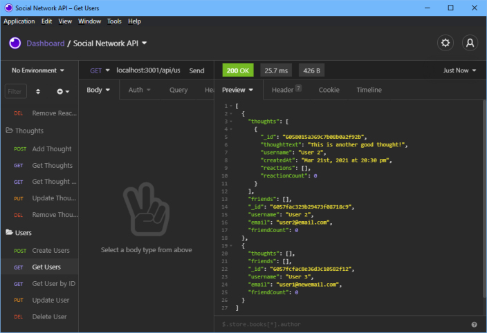

# Social-Network-API
API for a social network web application where users can share their thoughts, react to friends’ thoughts, and create a friend list.

# Installation

Clone the repositry from GitHub and open using Visual Studio Code.

# Usage 

# Credits

Made by [Russ Tracy]

[express.js](https://www.npmjs.com/package/express)

[mongoose](https://mongoosejs.com/)

# Questions

[Contact Me](russ_tracy@comcast.net)

[GitHub](https://github.com/russtracy)